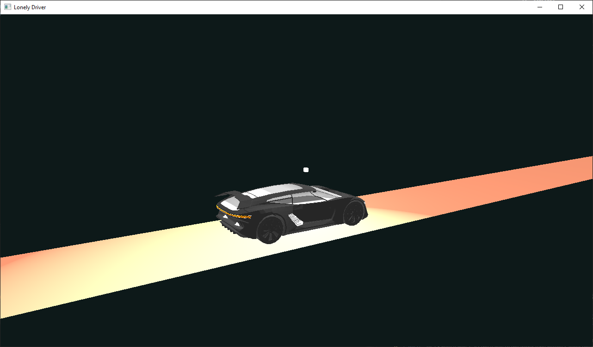
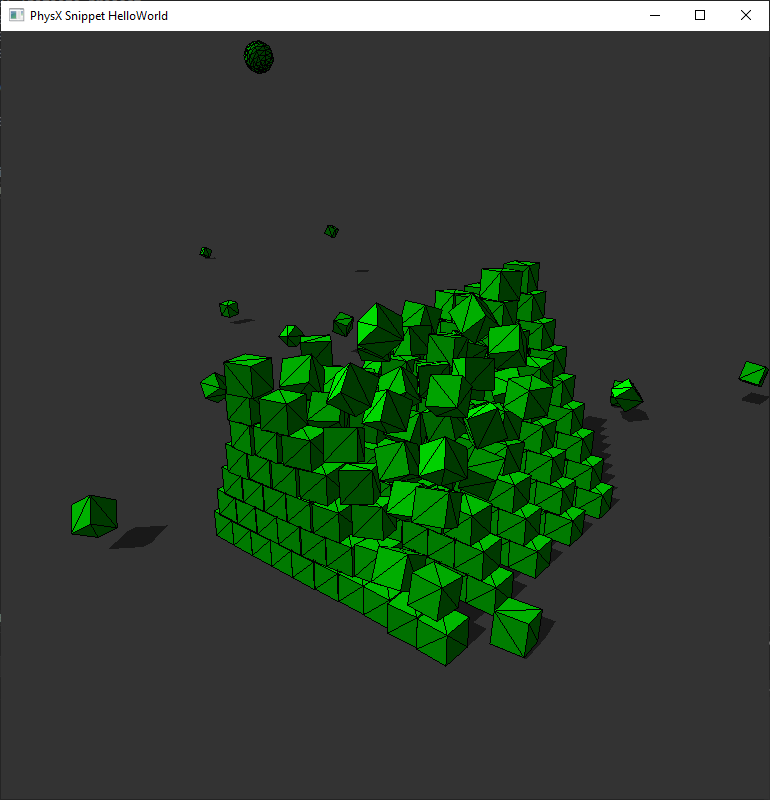
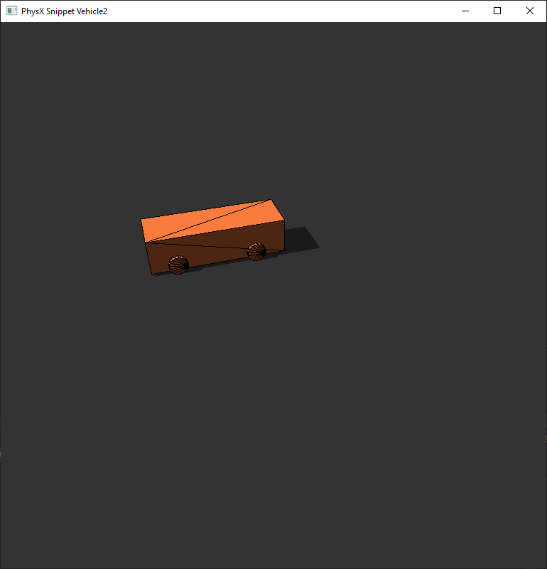
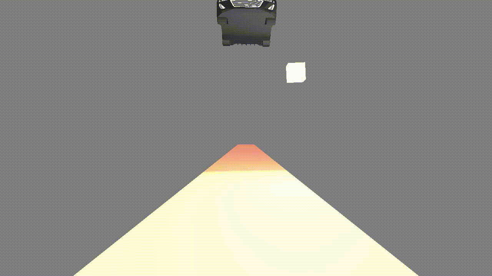
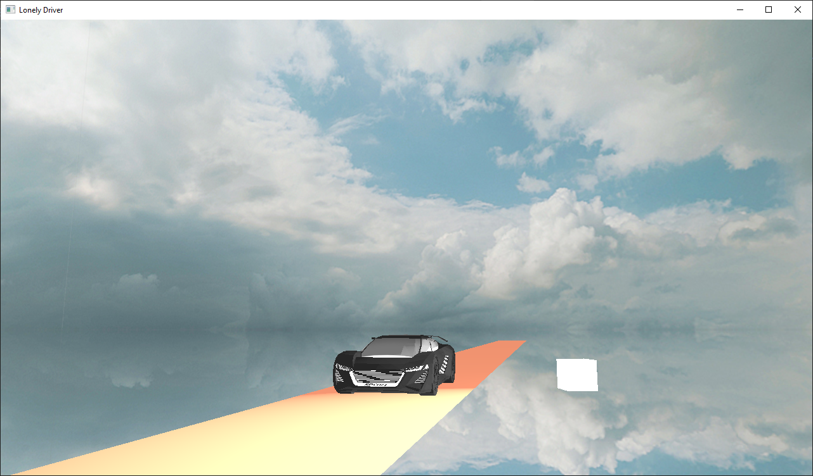
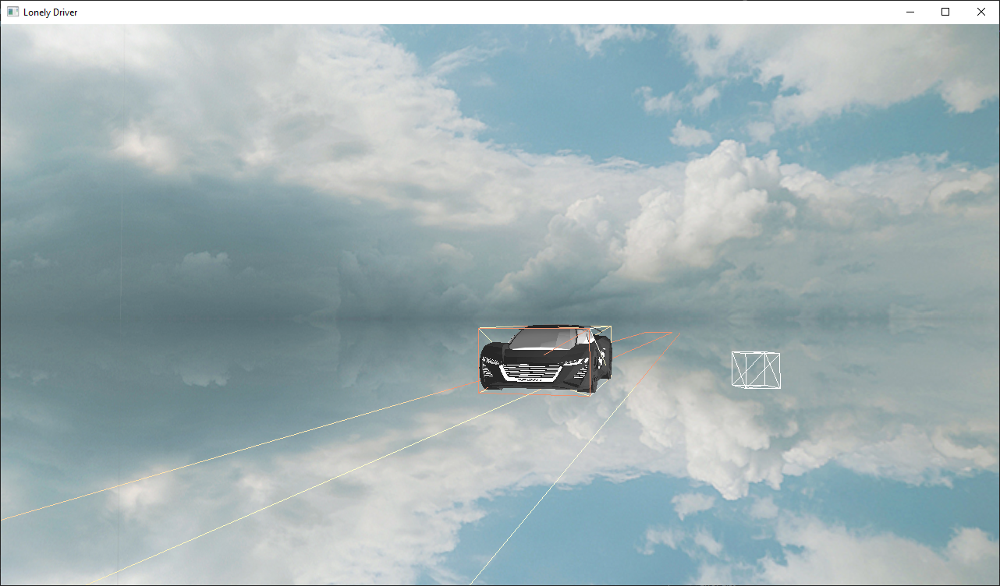
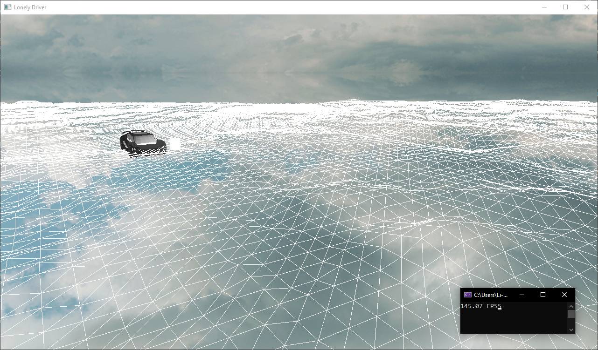
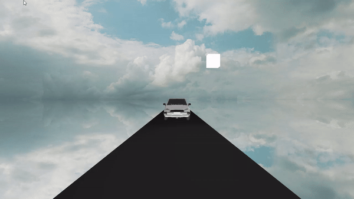
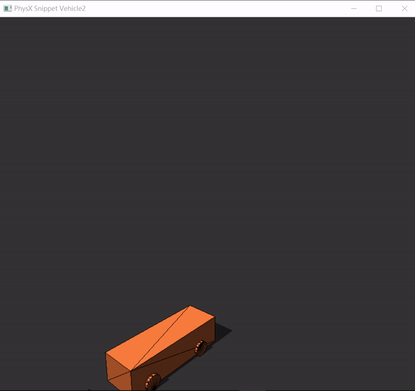

# LonelyDriver
### Dev log
- 12/13/2023: Initiate project
- 12/14/2023: Created singleton Window class
- 12/15/2023: Render car model
- 12/19/2023: Add light source and road (plane)

- 12/21/2023: Successfully run PhysX snippet (Hello world and Vehicle drive)

- 12/27/2023: Added gravity to car model and light cube
- separated phisics functionalities into a singleton class

- 12/28/2023: Draw skybox using cubemap. Created `Skybox` class that derives `Drawable` for special draw calls.
- Toggle var `DrawWireframe` in `App` class to draw wireframe.  

- 12/31/2023: Generated terrain using height map with Tesselation shader.

- 1/3/2024: changed car model (fixed missing textures) and use [semi-fixed time step](https://gafferongames.com/post/fix_your_timestep/) for render loop and physics step stability.

> [!WARNING]  
> I haven't tried to apply PhysX height feild, Not sure if it suits for collision with vehicle so I didn't try it yet. Now I am just going to let the vehicle run on a plane and add textures to the plane instead of using the tesselated terrain.

- 1/4/2024 Import and draw fbx model recursively \
This is for animating wheel direction when turing. I'm not sure why the transformation hierarchy works as I am applying scaling at the left-most of the `model` matrix (`M = T_drawOffset * S * T_2 * T_1 * R`), I thought it should be ` M = T_drawOffset * T_2 * T_1 * R * S`.

- 1/6/2024 Added physX vehicle simulation and attached with car model. \
The car is moving in pre-choreographed sequence.

- 1/8/2024 Studied Physx Vehicle SDK structure and applied collision onto vehicle and object in scene. \

- 1/11/2024 Add user input control car throttle, brake, and steer. \
Add Imgui and following camera (to be imporved).

1/15
tree dosn't appear if srawn after terrain.

### TODOs
- [x] clean way to render wireframes (bounding box)
- [x] vehicle physics and user control
- [x] render terrain with textures.
- [ ] calculate normal matrix on CPU and send in as uniform
- [ ] implement better following camera
- [ ] interpolate wheel rotation
- [ ] add normal and environment mapping in model shder
- [ ] change pointers to smart pointers
- [ ] terrain, compare CPU vs GPU generation peformance (speed, memory)
- [ ] should I move all dependencies (glfw, glm...) into solution folder?

### List of Implemented Features
- Tessellation shader for terrain.
- Incorporated Nvidia PhysX and vehicle SDK.
- 